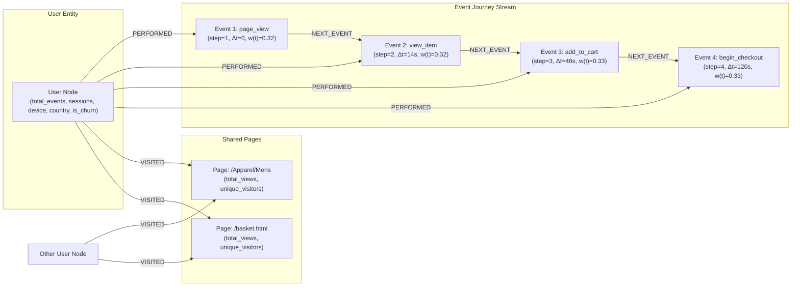

# 🔮 Predicting Customer Churn Risk Over Time with BigQuery Graph (GQL) & Distributed Graph Flow (DGF)

[](https://colab.research.google.com/github/GoogleCloudPlatform/bigquery-samples/blob/main/graph/ga4-churn-gnn/ga4_churn_gnn_bq_graph.ipynb)
[](https://console.cloud.google.com/vertex-ai/colab/import/https%3A%2F%2Fraw.githubusercontent.com%2FGoogleCloudPlatform%2Fbigquery-samples%2Fmain%2Fgraph%2Fga4-churn-gnn%2Fga4_churn_gnn_bq_graph.ipynb)
[](https://docs.cloud.google.com/bigquery/docs/graph-overview?utm_campaign=CDR_0x6cb6c9c7_default_b549221282&utm_medium=external&utm_source=other)

An end-to-end enterprise **Graph Machine Learning (Graph Neural Network)** workflow on real-world **Google Analytics 4 (GA4) eCommerce** clickstream data, powered by **[BigQuery Graph (ISO GQL)](https://docs.cloud.google.com/bigquery/docs/graph-overview?utm_campaign=CDR_0x6cb6c9c7_default_b549221282&utm_medium=external&utm_source=other)**, **BigQuery DataFrames (BigFrames)**, and **Distributed Graph Flow (DGF)**.

---

## 📖 Overview

Customer churn prediction in digital commerce requires capturing not only **aggregate user features** (such as visit frequency, country, or device category), but also the **fine-grained, chronological topology of user interaction journeys**.

Traditional tabular machine learning models flatten customer event streams into static summary statistics (RFM metrics), losing critical behavioral context:
1. **Action sequences and transition pathways** ($A \to B \to C$ vs. $A \to C \to B$).
2. **Dynamic inter-event temporal latency** ($\Delta t$ between consecutive actions).
3. **Recency decay** (events from today carry stronger predictive signals than events from weeks ago).
4. **Cross-user behavioral similarity** (collaborative signals between customers browsing the same product pages).

This lab demonstrates how to model GA4 clickstream sequences as a **heterogeneous temporal property graph** directly in BigQuery, explore customer journeys with **ISO GQL**, and train a supervised **Graph Neural Network (GNN)** using **Distributed Graph Flow (DGF)** to predict customer churn risk and write actionable risk scores back to BigQuery.

---

## 🏗️ Graph Schema & Architecture

We segment the GA4 event stream (`bigquery-public-data.ga4_obfuscated_sample_ecommerce`) into two non-overlapping windows to prevent target leakage:
- **Observation Window (Nov 1, 2020 – Dec 31, 2020 / 61 Days)**: Used to construct user profiles, sequential event touchpoints, shared page nodes, and temporal edge features.
- **Prediction Window (Jan 1, 2021 – Jan 31, 2021 / 31 Days)**: Used strictly to derive ground-truth `is_churn` labels (`0` = Retained, `1` = Churned).

### Heterogeneous Property Graph Topology



| Entity Type | Table / Label | Description |
| :--- | :--- | :--- |
| **Node** | `users` (`user_nodes`) | Aggregate user profile attributes (`total_events`, `session_count`, `device_category`, `traffic_medium`, `country`) and target label `is_churn`. |
| **Node** | `events` (`event_nodes`) | Individual interaction touchpoints (`page_view`, `view_item`, `add_to_cart`, `begin_checkout`, `purchase`) enriched with $\ln(1 + \Delta t)$, exponential recency decay $w(t)$, step ordinal, and normalized temporal position. |
| **Node** | `pages` (`page_nodes`) | Shared site pages (`page_location` with query strings stripped, filtered to exclude noisy global hub pages) enabling 2-hop cross-user message passing ($U_i \to P_j \leftarrow U_k$). |
| **Edge** | `PERFORMED` | Directed edge connecting a `User` to each `Event` they performed ($U_i \to E_{i,t}$). |
| **Edge** | `NEXT_EVENT` | Directed chronological transition between consecutive events in a user's journey ($E_{i,t} \to E_{i,t+1}$). |
| **Edge** | `VISITED` | Directed edge connecting a `User` to each distinct `Page` they viewed ($U_i \to P_j$), weighted by `view_count` and `last_visit_recency`. |

---

## 📓 Notebook Walkthrough

| Section | Topic | Key Capabilities Demonstrated |
| :--- | :--- | :--- |
| **1. System Architecture & Temporal Graph Theory** | Window partitioning & feature design | Preventing target leakage with non-overlapping observation/prediction windows; continuous temporal feature engineering ($\Delta t$, exponential recency decay). |
| **2. BigQuery Extraction & Materialization** | Node & edge table creation | SQL feature extraction from GA4 nested `event_params` and in-cloud exploration with **BigQuery DataFrames (`bigframes.pandas`)**. |
| **3. BigQuery Property Graph & ISO GQL** | Native graph DDL & querying | Declaring the graph via `CREATE OR REPLACE PROPERTY GRAPH`, interactive path visualization with `TO_JSON`, cross-user path discovery, and 3-hop funnel comparison via `GRAPH_TABLE`. |
| **4. Distributed Graph Flow (DGF) Ingestion** | Direct Property Graph loading | Loading the BigQuery Property Graph into an `InMemoryGraph` with `dgf.io.read_bigquery_graph` and declaring explicit `NUMERICAL` / `CATEGORICAL` feature semantics. |
| **5. Supervised Node Classification (GNN)** | Model training | Training a 2-hop message-passing Graph Neural Network on `users` nodes (`dgf.learning.train_node_model`) with strict train/validation/test seed node splits. |
| **6. Model Evaluation & Diagnostics** | Held-out test cohort metrics | Evaluating AUC-ROC (**~0.82**), accuracy, precision-recall curves, and confusion matrices on unseen test users. |
| **7. Churn Risk Scoring & BigQuery Export** | Tier segmentation & activation | Segmenting customers into *Low*, *Medium*, *High*, and *Critical* risk tiers and exporting scored predictions back to BigQuery via `bigframes.pandas.DataFrame.to_gbq()`. |
| **8. Behavioral Dossiers with ISO GQL** | Explainable graph analytics | Joining GNN risk predictions with `GRAPH_TABLE` path queries to compare touchpoint funnels of Critical-Risk vs. Low-Risk cohorts. |
| **9. Enterprise Best Practices & Cleanup** | Production MLOps | Rolling window schedules, CPU vs. GPU sizing, continuous GQL monitoring, and reservation cleanup. |

---

## 🚀 Getting Started

### Prerequisites

1. **Google Cloud Project** with billing enabled and the following APIs active:
   - BigQuery API (`bigquery.googleapis.com`)
   - BigQuery Reservation API (`bigqueryreservation.googleapis.com`)
   - Cloud Storage API (`storage.googleapis.com`)
2. **Cloud Storage Bucket** (used by DGF as a temporary staging `work_dir` when reading the BigQuery Property Graph).
3. **BigQuery Enterprise or Enterprise Plus Reservation**:
   > [!IMPORTANT]
   > **[BigQuery Graph (GQL)](https://docs.cloud.google.com/bigquery/docs/graph-overview?utm_campaign=CDR_0x6cb6c9c7_default_b549221282&utm_medium=external&utm_source=other) requires an Enterprise or Enterprise Plus reservation** and does not run under on-demand pricing. You can create a cost-efficient autoscaling reservation (`--slots=0 --autoscale_max_slots=100`) that costs nothing when idle:
   ```bash
   # Enable the BigQuery Reservation API
   gcloud services enable bigqueryreservation.googleapis.com --project=<PROJECT_ID>

   # Create an Enterprise reservation with 0 baseline slots and 100 max autoscaling slots
   bq mk --reservation \
     --project_id=<PROJECT_ID> \
     --location=US \
     --edition=ENTERPRISE \
     --slots=0 \
     --autoscale_max_slots=100 \
     --ignore_idle_slots=true \
     ga4-churn-reservation

   # Assign your project to the reservation for QUERY jobs
   bq mk --reservation_assignment \
     --project_id=<PROJECT_ID> \
     --location=US \
     --reservation_id=ga4-churn-reservation \
     --job_type=QUERY \
     --assignee_type=PROJECT \
     --assignee_id=<PROJECT_ID>
   ```

### Running the Lab

1. Open [ga4_churn_gnn_bq_graph.ipynb](./ga4_churn_gnn_bq_graph.ipynb) in **Vertex AI Colab Enterprise**, **Google Colab**, or a local Jupyter environment.
2. In **Section 1**, set your `PROJECT_ID`, `DATASET_ID`, `LOCATION` (`US`), and `GCS_BUCKET`.
3. Run the cells sequentially to materialize the node/edge tables, create and query the BigQuery Property Graph with ISO GQL, train the GNN with DGF, and export churn risk scores back to BigQuery.

---

## 📚 Resources

- [BigQuery Graph Overview Documentation](https://docs.cloud.google.com/bigquery/docs/graph-overview?utm_campaign=CDR_0x6cb6c9c7_default_b549221282&utm_medium=external&utm_source=other)
- [Google Analytics 4 BigQuery Public Dataset](https://console.cloud.google.com/marketplace/product/obfuscated-ga360-data/obfuscated-ga4?utm_campaign=CDR_0x6cb6c9c7_default_b549221282&utm_medium=external&utm_source=other)
- [BigQuery DataFrames (BigFrames) Documentation](https://cloud.google.com/python/docs/reference/bigframes/latest?utm_campaign=CDR_0x6cb6c9c7_default_b549221282&utm_medium=external&utm_source=other)
